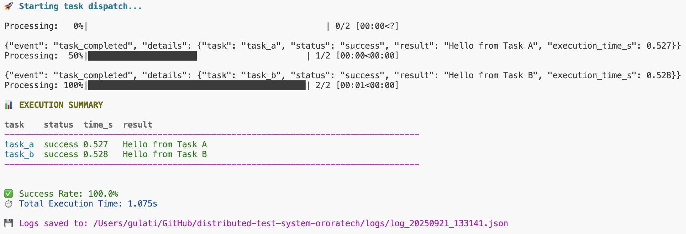

# Distributed Test System

A distributed automated test system built with RabbitMQ, Celery, and Docker that demonstrates task routing, worker isolation, and concurrent execution.

> 📋 **Original Challenge Requirements**: See [TestEngineer_TechChallenge.pdf](./TestEngineer_TechChallenge.pdf) for the complete challenge specification.

---

## 🏗️ Architecture

```
┌─────────────────┐    ┌─────────────────┐    ┌─────────────────┐
│   dispatch.py   │    │   RabbitMQ      │    │  Docker Workers │
│   (Dispatcher)  │────│   (Broker)      │────│                 │
│                 │    │                 │    │  ┌─────────────┐│
└─────────────────┘    │  ┌──────────────┤    │  │  Worker A   ││
                       │  │   queue_a    │◄───┤  │ (task_a)    ││
                       │  │              │    │  └─────────────┘│
                       │  ├──────────────┤    │  ┌─────────────┐│
                       │  │   queue_b    │◄───┤  │  Worker B   ││
                       │  │              │    │  │ (task_b)    ││
                       │  └──────────────┘    │  └─────────────┘│
                       └─────────────────┘    └─────────────────┘
```
- **task_a**: Processed only by worker-a (queue_a)
- **task_b**: Processed only by worker-b (queue_b)
- **RabbitMQ**: Message broker running on host
- **Docker**: Two isolated worker containers

## 🚀 Features

### Core Requirements
- ✅ **RabbitMQ Integration**: Message broker running locally
- ✅ **Celery Tasks**: Two isolated tasks (`task_a` and `task_b`)
- ✅ **Container Isolation**: Each worker processes only designated tasks
- ✅ **Concurrent Execution**: Parallel task dispatching and result collection

### Enhanced Features
- 🎨 **Rich Visualization**: Colored output with real-time status updates
- 📊 **Performance Metrics**: Execution timing and statistics
- 📝 **Structured Logging**: JSON-formatted logs with metadata
- ⚙️ **Setup Automation**: Interactive setup script
    - Checks system requirements (Docker, Rabbitmq, Python3+)
    - Start Rabbitmq
    - Install python dependencies
    - Execute task and save logs
    - Shut down containers

## 📋 Prerequisites

- **Docker & Docker Compose**: For container orchestration (from: `https://www.docker.com/get-started/`)
- **RabbitMQ**: Message broker (running locally, not in container)
- **Python 3.8+**: For local development and testing

## 🛠️ Setup Instructions

### 1. Install and Start RabbitMQ

#### macOS (using Homebrew)
```bash
# Install RabbitMQ
brew install rabbitmq
```

#### Verify RabbitMQ Installation
```bash
# Check if RabbitMQ is running
sudo rabbitmqctl status
```

### 2. Clone and Setup Project

```bash
# Clone the repository (or download the files)
git clone <repository-url>
````
> Make sure Docker Desktop is running in the background!

## Approach 1: Quick Start with setup.sh (no need to start rabbitmq manually)

The easiest way to run the system:

```bash
./setup.sh   # Complete automated test
```

## Approach 2: Using Makefile

#### 1. Start RabbitMQ as a service
```bash
brew services start rabbitmq
```

#### 2. Run Complete Automated Test
```bash
make test
```

Or step by step:
```bash
make up         # Start containers
make run        # Run dispatcher
make down       # Stop containers
```

#### Makefile Commands

```bash
make help       # Show usage
make install    # Install dependencies
make build      # Build containers
make up         # Start containers
make down       # Stop containers
make run        # Run dispatcher
make test       # Full test sequence
make logs       # Show logs
make ps         # Container status
make clean      # Clean up
```

## Approach 3: Manual Setup

#### 1. Start RabbitMQ as a service
```bash
brew services start rabbitmq
```

#### 2. Install Python dependencies
```
pip install -r requirements.txt
```

#### 3. Build and Run Worker Containers

```bash
# Build the Docker image
docker-compose build

# Start both worker containers
docker-compose up -d

# Verify containers are running
docker-compose ps
```

Expected output:
```
 Name                    Command               State    Ports
----------------------------------------------------------------
%-worker-a   celery -A celery_app worke ...   Up ...
%-worker-b   celery -A celery_app worke ...   Up ...
```

### 4. Run the Dispatcher

```bash
# Execute the dispatcher script
python dispatch.py
```

## 📱 Expected Output example



## How to Visualize Results

The dispatcher provides multiple ways to monitor and visualize task execution:

#### Real-time Console Output
During execution, you'll see:
- **Progress bar** showing task completion status
- **Colored ASCII table** summarizing results with 
    - **Status-based colors:**
        - **Green**: Successful tasks
        - **Red**: Failed tasks  
        - **Magenta**: Timeout status specifically
        - **Yellow**: Unknown/pending status
    - **Time-based colors:**
        - **Green**: Execution time <1s
        - **Yellow**: Execution time <5s
        - **Red**: Otherwise 
- **Live metrics** including success rate and individual and total execution times
- **Structured JSON Logs**
    - All execution data is automatically saved to timestamped JSON files in `/logs/`

## Files

- `celery_app.py`: Celery configuration and tasks
- `dispatch.py`: Simple dispatcher script
- `Dockerfile`: Worker container definition
- `docker-compose.yml`: Container orchestration
- `requirements.txt`: Python dependencies

## Cleanup

```bash
docker-compose down
#or
make clean
```
